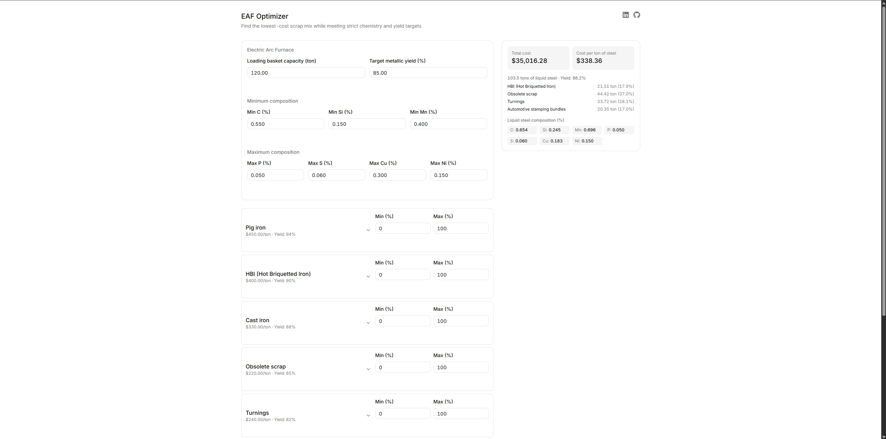

# EAF Optimizer

**Find the lowest-cost scrap mix for an Electric Arc Furnace charge — without compromising target chemistry or metallic yield.**

🔗 **Live demo:** [eaf-optimizer.vercel.app](https://eaf-optimizer.vercel.app)



---

## Why this exists

Scrap is the single largest cost driver in EAF steelmaking, and charge makeup decisions are often made by rule of thumb. Each scrap grade carries a different price, metallic yield, and residual chemistry (Cu, Ni, P, S...) — and the cheapest material per ton is rarely the cheapest path to on-spec liquid steel.

This project models the charge selection problem as a **linear program**: given a catalog of scrap materials and a set of metallurgical constraints, it computes the charge mix that minimizes total cost while guaranteeing that yield and chemistry targets are met. The current scope stops at the charge — oxygen and refining additions are the next layer, see [Roadmap](#roadmap).

I built it as a working demonstration of the intersection between industrial process knowledge and software engineering — the two disciplines I work across as a metallurgical engineer.

## What it does

- **Cost-optimal charge selection** across 8 scrap grades (pig iron, HBI, shredded, HMS, turnings, obsolete scrap, cast iron, automotive stamping bundles), each with realistic price, yield, and 13-element residual chemistry data
- **Metallurgical constraints** you'd actually use at a meltshop:
  - Loading basket capacity (charge mass balance)
  - Minimum metallic yield target
  - Composition floors (C, Si, Mn — what the charge must bring in before the blow)
  - Composition ceilings (P, S, Cu, Ni — residuals the furnace cannot remove downstream)
  - Optional per-material min/max participation bounds
- **Honest infeasibility handling** — when constraints cannot be satisfied simultaneously, the API returns a structured 422 and the UI explains it, instead of silently relaxing constraints
- **Full result breakdown**: tonnage and charge share per material, liquid steel produced, achieved metallic yield, final composition, total cost and cost per ton of liquid steel

## The optimization model

The solver minimizes **total charge cost** subject to:

| Constraint | Form |
|---|---|
| Basket capacity | Σ xᵢ = capacity |
| Metallic yield | Σ (yieldᵢ/100) · xᵢ ≥ capacity · (target/100) |
| Element floors (C, Si, Mn) | element mass in liquid steel ≥ floor |
| Element ceilings (P, S, Cu, Ni) | element mass in liquid steel ≤ ceiling |
| Per-material bounds | minᵢ ≤ xᵢ/capacity ≤ maxᵢ |

**A modeling note worth being explicit about:** the objective is total charge cost, which is linear in the decision variables. Cost *per ton of liquid steel* — the number a meltshop manager actually quotes — is a ratio of two decision-dependent quantities and therefore nonlinear; it is reported as a derived output, not optimized directly. For fixed capacity and binding yield constraints the two align closely, but they are not the same objective, and conflating them is a common modeling mistake.

**Known simplification:** the composition model assumes 100% recovery of each element into the liquid steel — no oxidation losses during melting and refining. Element partitioning (particularly for C, Si, Mn) would be the natural next refinement, but it requires process-specific data that goes beyond the scope of a public demo.

## Tech stack

| Layer | Technology |
|---|---|
| Optimization | Python, [PuLP](https://coin-or.github.io/pulp/) (CBC solver) |
| API | FastAPI, Pydantic v2 |
| Frontend | Next.js 16, TypeScript, React Hook Form, Zod |
| UI | shadcn/ui (Base UI), Tailwind CSS |
| Deployment | Render (API), Vercel (frontend) |

Frontend details that mattered in practice:

- **Centralized number formatting** (`lib/format.ts`) — every currency, tonnage, and composition value in the UI goes through a single set of formatters, so decimal-place consistency is guaranteed by construction rather than by convention
- **Type-safe numeric form fields** — a `NumberField` component constrained by a mapped conditional type (`NumericFieldPath`), so passing a non-numeric form path is a compile-time error
- **Locale-tolerant validation** — a Zod `decimalNumber()` helper accepts both comma and period as decimal separators
- **Discriminated-union API client** — `optimize()` never throws; it returns `{ok: true, data}` | `{ok: false, reason, detail}`, cleanly separating solver infeasibility (422) from network/server failures in the UI

## API

Base URL: `https://eaf-optimizer.onrender.com`

| Endpoint | Description |
|---|---|
| `POST /optimize` | Runs the LP. Body: `{materials: Material[], constraints: Constraints}`. Returns the optimal mix, or 422 with detail when infeasible. |
| `GET /health` | Liveness check used by the hosting platform. |

All composition, yield, and bound fields use **percentages (0–100)**. Masses in metric tons, prices in USD.

<details>
<summary>Example request/response</summary>

```jsonc
// POST /optimize (abridged)
{
  "materials": [
    {
      "name": "Shredded scrap",
      "price": 370,
      "metallic_yield": 91,
      "c": 0.25, "si": 0.20, "mn": 0.45, "p": 0.02, "s": 0.03,
      "cu": 0.20, "ni": 0.10,
      // ... remaining composition fields
      "min_pct": null,
      "max_pct": null
    }
    // ... other materials
  ],
  "constraints": {
    "loading_basket_capacity": 120,
    "target_yield": 85,
    "c_min": 0.25, "si_min": 0.15, "mn_min": 0.3,
    "p_max": 0.05, "s_max": 0.06, "cu_max": 0.3, "ni_max": 0.15
  }
}
```

```jsonc
// 200 response (abridged)
{
  "scrap_mix": { "Shredded scrap": 80.0, "HMS (Heavy Melting Steel)": 40.0 },
  "liquid_steel": 108.0,
  "metallic_yield": 90.0,
  "composition": { "c": 0.28, "si": 0.19, /* ... */ },
  "cost": { "total": 43600.0, "per_ton": 403.70 }
}
```

</details>

## Repository structure

```
├── backend/
│   └── app/
│       ├── main.py            # FastAPI app, CORS, /health
│       ├── routers/           # /optimize endpoint
│       ├── services/          # LP model (PuLP)
│       └── schemas/           # Pydantic request/response models
└── frontend/
    └── src/
        ├── app/               # Next.js app router
        ├── api/               # typed client + request builder
        ├── components/        # form, material bounds, result panel
        ├── schemas/           # Zod form validation
        ├── lib/format.ts      # centralized number formatting
        └── data/materials.ts  # scrap catalog
```

## Running locally

**Backend** (Python 3.12+):

```bash
cd backend
pip install -r requirements.txt
uvicorn app.main:app --reload
```

The API runs at `http://127.0.0.1:8000`. CORS allows `http://localhost:3000` by default; override with the `ALLOWED_ORIGINS` env var (comma-separated list) in production.

**Frontend** (Node 20+):

```bash
cd frontend
npm install
npm run dev
```

Create `frontend/.env.local`:

```dotenv
NEXT_PUBLIC_API_BASE_URL=http://127.0.0.1:8000
```

## Roadmap

- **V2:**
  - User accounts (Supabase OAuth), per-user material catalogs with real prices, optimization run history (Postgres + SQLAlchemy async + Alembic)
  - **Refining-stage mass balance** extending the model beyond charge selection: oxygen consumption and flux/alloy additions during refining, so total cost reflects the full melt — not just the scrap charge
  - Element recovery factors to model oxidation losses during melting

## Author

**Paulo Vinicius Toledo** — Metallurgical Process Engineer (MSc) working at the intersection of industrial process and software.

[LinkedIn](https://www.linkedin.com/in/paulo-vinicius-toledo) · [GitHub](https://github.com/pv-toledo)
